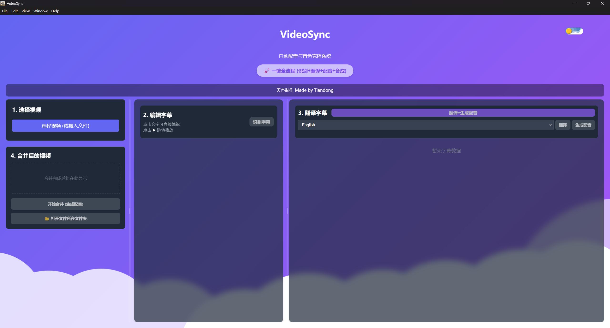
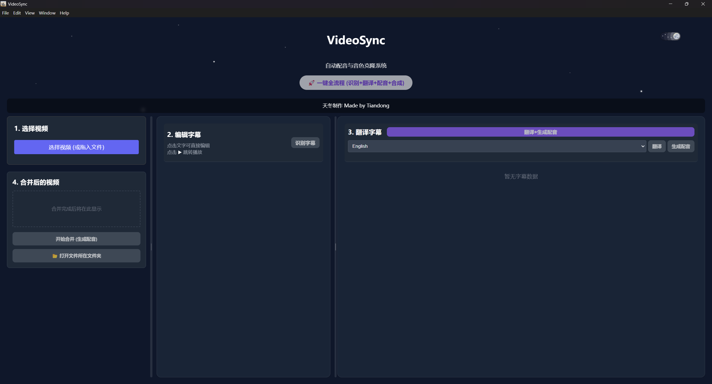

# 🎬 VideoSync - AI Video Localization Tool

<div align="center">

 

**One-Click Local AI Video Dubbing & Translation Tool**

[中文文档](README.md) | [English](README_EN.md)

</div>

**VideoSync** is a fully automated AI video dubbing tool designed for Windows and Linux. It orchestrates state-of-the-art open-source models into a seamless workflow for "one-click" video localization.

No cloud APIs, no subscription fees. Use your local GPU to perform **ASR (Speech Recognition) -> Text Translation -> Voice Cloning -> Audio-Video Alignment**.

---

## ✨ Features

*   **🎯 Accurate Recognition (ASR)**
    *   Powered by **WhisperX**, featuring accurate VAD (Voice Activity Detection) and Forced Alignment.
    *   Eliminates hallucinations and missing words common in traditional Whisper, with millisecond-level precision.

*   **🗣️ One-Shot Voice Cloning**
    *   Integrated with **MaskGCT** (IndexTTS), requiring no fine-tuning.
    *   Clones source voices instantly using just 3-10 seconds of reference audio.
    *   Perfectly preserves tone, emotion, and speech rhythm.

*   **🌏 Powerful LLM Translation**
    *   Built-in **Qwen 2.5-7B-Instruct** large language model.
    *   Supports deep context-aware translation between English, Chinese, Japanese, Korean, and more.
    *   Produces natural, subtitle-group quality translations.

*   **⚡ Extreme Optimization**
    *   Unique sequential VRAM management: Unloads LLM during TTS generation and vice versa.
    *   Runs smoothly on consumer-grade GPUs (e.g., RTX 3060 with 6GB-8GB VRAM).

*   **🖥️ Modern UI**
    *   Beautiful interface built with Electron + React.
    *   Real-time log monitoring, visual subtitle editing, and instant video preview.

---

## 📸 Screenshots

| Main Interface | 
| :---: |
|  |
| Subtitle Editor |
| :---: |
|  |

---

## 🛠️ Requirements

For optimal performance, we recommend the following hardware:

*   **OS**: Windows 10/11 (x64) or Linux (Preview)
*   **GPU**: NVIDIA GeForce RTX 3060 or better (VRAM ≥ 6GB)
*   **Driver**: NVIDIA Studio/Game Ready Driver (CUDA 11.8+)
*   **Runtime**: Python 3.10+, Node.js 16+ (Required for source execution)

---

## 🚀 Quick Start

### 1. Clone Repository
```bash
git clone https://github.com/YourUsername/VideoSync.git
cd VideoSync
```

### 2. Backend Setup
We strongly recommend using Conda to manage environments.

```bash
# Create and activate environment
conda create -n videosync python=3.10
conda activate videosync

# Install core dependencies
pip install -r backend/requirements.txt

# Install PyTorch (Check pytorch.org for your specific CUDA version)
# Example (CUDA 12.1):
pip install torch torchvision torchaudio --index-url https://download.pytorch.org/whl/cu121
```

### 3. Frontend Setup
```bash
cd ui
npm install
```

### 4. Download Models
Due to their large size, models are not included in the repo. Please download them and place them in the `models/` directory:

> **Download Sources**: [HuggingFace](https://huggingface.co/) or [ModelScope](https://www.modelscope.cn/).

```text
VideoSync/
  ├── models/
  │   ├── faster-whisper-large-v3-turbo-ct2/  # ASR Model
  │   ├── index-tts/                          # MaskGCT / TTS Model files
  │   │   ├── config.yaml
  │   │   ├── gpt.pth ...
  │   └── Qwen2.5-7B-Instruct/                # LLM Translation Model
```

---

## 📖 Usage

### Option 1: Run from Source (Recommended for Devs/Linux)

1.  **Start Frontend UI**:
    ```bash
    cd ui
    npm run dev
    ```
    The Electron window will launch and automatically spawn the Python backend.

    *Note: You can manually run the backend for testing via `python backend/main.py --action test_audio`.*

### Option 2: Build Installer (Windows)

To generate an `.exe` installer:

```bash
cd ui
npm run build
```
The installer will be generated in `ui/release/`.

---

## ❓ FAQ

**Q: Why do I get "CUDA out of memory"?**
A: MaskGCT is VRAM intensive. While we optimized the pipeline, running on 4GB-6GB cards requires closing other GPU-heavy apps.

**Q: Can it recognize Chinese path names?**
A: Yes, we fixed FFmpeg unicode handling. However, using English paths is always safer.

**Q: Why is the first run slow?**
A: The system automatically downloads auxiliary models (like VAD and BERT) from HuggingFace on the first initialization.

---

## 🤝 Acknowledgements

This project stands on the shoulders of giants. Special thanks to:

*   [**IndexTTS**](https://github.com/index-tts/index-tts): For the voice cloning support.
*   [**WhisperX**](https://github.com/m-bain/whisperX): For precise alignment and VAD.
*   [**Qwen**](https://github.com/QwenLM/Qwen3): For powerful multilingual capabilities.

If you like this project, please give us a Star 🌟!
PRs and Issues are welcome.

---

## 📜 License

*   ✅ **Non-Commercial**: You are free to copy, modify, and distribute the code for **non-commercial purposes only**.
*   ❌ **No Commercial Use**: Use of this project or its derivatives for commercial gain is strictly prohibited without prior authorization.
*   🔄 **ShareAlike**: If you modify the code, you must distribute your contributions under the same license.

© 2024 VideoSync Team
